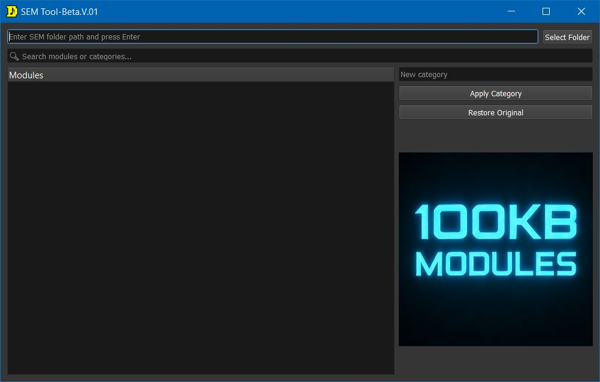

# 🎛️ SEM Tool — Beta v0.1

## Screenshot

<p align="center">
  
</p>

A lightweight Windows utility for organizing, browsing, and recategorizing `.sem` plugin modules.

SEM Tool scans your plugin folders, builds a searchable category tree, and lets you quickly edit plugin categories.

---

# 📥 Download

1. Open the **Releases** section
2. Download `SEMTool.exe`
3. Run the executable

No installation required.

> ⚠️ Because the application is not code-signed, Windows SmartScreen or antivirus software may display a warning the first time you run it.
>
> Click:
>
> **More Info → Run Anyway**

---

# ✨ Features

* 📂 Recursive scanning of `.sem` plugin folders
* 🌲 Tree-based category browser
* 🔍 Instant search/filter for plugins and categories
* ✏️ Single or multi-plugin category editing
* 💾 Automatic `.original` backup creation before modification
* ♻️ One-click restore to original plugin state


---

# 🚀 How To Use

### 1. Launch the App

Run:

```text
SEMTool.exe
```

### 2. Select Your SEM Folder

* Click **Select Folder**
  OR
* Paste the folder path and press **Enter**

### 3. Browse Plugins

Plugins are automatically grouped into categories inside the tree view.

### 4. Search

Use the search bar to instantly filter modules or categories.

### 5. Change Categories

* Select one or more plugins
* Enter a new category
* Press **Apply Category**


### 6. Done

The plugin DLL is updated immediately.

---

# ♻️ Restore Original

Before the first modification, SEM Tool automatically creates:

```text
plugin.sem.original
```

To restore:

* Select the modified plugin
* Press **Restore Original**

The original plugin file will be restored automatically.

---

# ⚠️ Important Warnings

> 🔴 ALWAYS BACK UP YOUR ENTIRE MODULES FOLDER BEFORE USING THIS TOOL

* This application directly modifies plugin DLL resources
* Make sure your DAW/host is completely closed before editing plugins
* Editing plugins while loaded may fail or corrupt files
* Use at your own risk

---

# 🧪 Status

Current version:

```text
Beta v0.1
```

Bug reports and feedback are highly appreciated.

---

# 💬 Feedback / Bug Reports

If you find bugs or have suggestions, open an Issue on GitHub.

---

# 📄 License

Free for personal use.

---

# 👤 Author

Made for the music production community 🎛️
